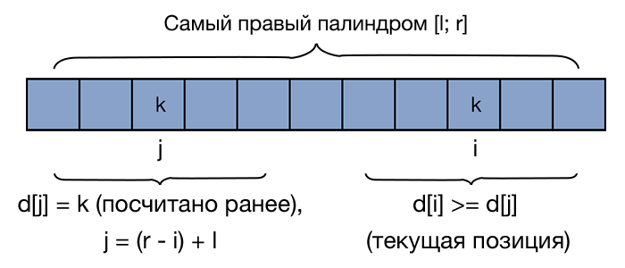
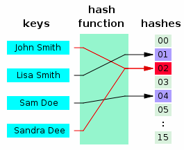

# Алгоритмы на Python
Данный репозиторий создан для того, чтобы хранить реализации полезных алгоритмов на языке Python.
В дальнейшем планируется сделать библиотеку.
## Оглавление
1. [Динамическое программирование](#1dinamic)
    + [Набольшая общая подпоследовательность](#nop)
    + [Наибольшая возрастающая подпоследовательность](#nvp)
    + [Расстояние Левенштейна](#levinshtein)
    + [Пилообразная подпоследовательность](#saw-raw)
    + [Задача о рюкзаке]
2. [Суффиксы, префиксы и подстроки](#2suffix)
    + [Z-функция *(Z-function)*](#z-function)
        + [Нахождение наидленнейшей грани в строке]
        + [Нахождение периода строки]
        + [Задача о неточном поиске]
        + [Число различных подстрок в строке]
        + [Сжатие строки]
        + [Палиндромные префиксы]
    + [Префикс-функция](#prefix-function)
        + [Подсчет числа вхождений каждого префикса]
        + [Количество различных подстрок в строке]
        + [Сжатие строки]
        + [Построение автомата по префикс-функции]
    + [Алгоритм Кнута-Морриса-Пратта](#knut-morris-pratt)
    + [Переход от Z-функции к префикс-функции и обратно]
    + [Суффиксный массив *(Suffix-array)*](#suffix-array)
        + [Число различных подстрок]
        + [Наибольшая общая подстрока]
    + [Алгоритм Манакера](#manaker)
        + [Наивный алгоритм](#manaker-slow)
    + [Хэш-функция](#hash-function)
        + [Количество различных подстрок](#hash-substrings)
        + [Поиск подстроки в строке](#hash-search)
        + [Сравнение строк](#hash-string-compare)
        + [Палиндромность подстроки](#hash-palidrom)
        + [Количество палиндромов](#hash-palindroms-count)
3. Структуры данных
    + [Куча с максимумом в вершине](#max-heap)
4. Поиск элементов
    + [Бинарный поиск](#binary-search)
5. [Векторная алгебра]
6. [Теория графов]
7. [Сортировки]

[Источники](#sorces)

## <a name="1dinamic"></a> 1 Динамическое программирование
Динамическое программирование - способ решения сложных задач путем 
сведения их к более простым такого же типа.

**Плюсы:**
+ Увеличение скорости

**Минусы:**
+ Дополнительные расходы памяти

**План решения задачи на ДП:**
1. Определить целевую функцию *f*;
2. Решить задачу для маленьких ограничений;
3. Получить реккурентную формулу;
4. Определить ограничения и задать начальные значения;
5. Определить порядок вычислений;
6. Определить где будет ответ;
7. Восстановить ответ.

### <a name="nop"></a> Наибольшая общая подпоследовательность
Задача нахождения наибольшей общей подпоследовательности
(англ. longest common subsequence, LCS) — задача
поиска последовательности, которая является 
подпоследовательностью нескольких последовательностей 
(обычно двух).

Подпоследовательность можно получить из некоторой 
конечной последовательности, если удалить из 
последней некоторое множество её элементов 
(возможно пустое). Например, **BCDB** является 
подпоследовательностью последовательности **ABCDBAB**.

#### Решение за O(n<sup>2</sup>)
Обозначим через F(i) длину наибольшей возрастающей
подпоследовательности, последним элементом которой
будет элемент a<sub>i</sub>.
Рассмотрим предпоследний элемент этой последовательности
 a<sub>j</sub>, тогда a<sub>j</sub> < a<sub>i</sub> и j < i.
Необходимо найти такое подходящее j, что F(j) будет наибольшим.

```python
a = input()
b = input()

n, m = len(a), len(b)

f = []
for i in range(n+1):
    f.append([0]*(m+1))

for i in range(1,n+1):
    for j in range(1,m+1):
        if a[i-1] == b[j-1]:
            f[i][j] = f[i-1][j-1] + 1
        else:
            f[i][j] = max(f[i-1][j],f[i][j-1])
print(f[-1][-1])
```
#### Восстановление ответа
Выполним «обратный проход» по массиву
начиная с последнего элемента.

```python
i = n
j = m
ans = []
while i > 0 and j > 0:
    if a[i-1] == b[j-1]:
        ans.append(a[i-1])
        i -= 1
        j -= 1
    elif f[i][j-1] == f[i][j]:
        j -= 1
    else:
        i -= 1
print(*a[::-1])
```
### <a name="nvp"></a> Наибольшая возрастающая подпоследовательность
Задача поиска наибольшей возрастающей подпоследовательности
состоит в нахождении наиболее длинной
возрастающей подпоследовательности в
данной последовательности элементов.

#### Решение за O(n<sup>2</sup>)

##### Способ 1:

+ Отсортировать последовательность в порядке неубывания,
+ Удалим из нее повторяющиеся элементы (то есть получим строго возрастающую
последовательность из элементов изначальной последовательности,
+ Для изначальной и отсортированной последовательностей  и
найдем наибольшую общую подпоследовательность.

##### Способ 2:

+ Обозначим через F(i) длину наибольшей возрастающей
подпоследовательности, последним элементом которой
будет элемент a<sub>i</sub>.
+ Рассмотрим предпоследний элемент этой
последовательности a<sub>j</sub>, тогда
a<sub>j</sub><a<sub>i</sub> и j<i.

```python
n = int(input())
a = [int(i) for i in input().split()]
f = [0] * n
p = [-1] * n
for i in range(n):
    max_el = 0
    for j in range(i):
        if a[j] < a[i] and f[j] > f[i]:
            f[i] = f[j]
            p[i] = j
    f[i] += 1

max_el = max(f)
print(max_el)
```
#### Восстановление ответа
Массив p содержит индексы элементов, из которых он пришел, поэтому
можно пройтись от максимального элемента до начала.
```python
i = f.index(max_el)
ans = []
while i != -1:
    ans.append(a[i])
    i = p[i]
print(*ans[::-1])
```

### <a name="levinshtein"></a> Расстояние Левенштейна

Расстояние Левенштейна (редакционное расстояние,
дистанция редактирования) — метрика, измеряющая
разность между двумя последовательностями символов.
  
Она определяется как минимальное количество
односимвольных операций (а именно вставки, удаления, 
замены), необходимых для превращения одной последовательности символов в другую.

В общем случае, операциям, используемым в этом 
преобразовании, можно назначить разные цены.

Пусть S<sub>1</sub>, S<sub>2</sub> — две строки (длиной M и N соответственно)
над некоторым алфавитом, тогда редакционное расстояние
(расстояние Левенштейна) d(S<sub>1</sub>,S<sub>2</sub>) можно подсчитать по
следующей формуле (элементы строк нумеруются с первого)
: d(S1, S2) = D(M, N), где


Пример:

Здесь шаг по i символизирует удаление (D)
из первой строки, по j — вставку (I)
в первую строку, а шаг по обоим индексам
символизирует замену символа (R) или отсутствие 
изменений (M).


#### Разные цены операций

Цены операций могут зависеть от вида операции (вставка, удаление, замена) и/или от участвующих в ней символов, отражая разную вероятность мутаций в биологии, разную вероятность разных ошибок при вводе текста и т. д. В общем случае:
+ w(a, b) — цена замены символа a на символ b
+ w(ε, b) — цена вставки символа b
+ w(a, ε) — цена удаления символа a

Необходимо найти последовательность замен, минимизирующую
суммарную цену. Расстояние Левенштейна является частным
случаем этой задачи при: 
w(a, а) = 0, w(a, b) = 1 при a≠b, w(ε, b) = 1, w(a, ε) = 1.


Листинг программы:

```python
a = input()
b = input()
n, m = len(a), len(b)

dp = []
for i in range(n+1):
    dp.append([0]*(m+1))

for i in range(1,n+1):
    dp[i][0] = i

for j in range(1,m+1):
    dp[0][j] = j

for i in range(1, n+1):
    for j in range(1, m+1):
        dp[i][j] = min(dp[i-1][j-1] + (a[i-1] != b[j-1]),
         dp[i][j-1]+1, dp[i-1][j] + 1)
print(dp[-1][-1])

```

### <a name="saw-raw"></a> Пилообразная подпоследовательность


## <a name="2suffix"></a> 2 Суфффиксы, префиксы и подстроки

### <a name="z-function"></a> Z - функция

Z-функция от строки s определяется как массив z, такой, что z<sub>i</sub>
равно длине максимальной подстроки, начинающейся с i-й позиции, которая равна
префиксу s.

Пример:
```
abacabadava
00103010101
a = 0 (первый элемент всегда равен 0 или длине строки)
ab = 0 (так как b не совпадает с префиксом)
aba = 1 (так как a совпадает с префиксом)
abac = 0
abaca = 3 (так как aba=aba)
и т.д.
```
#### Реализация за O(n)

```python
def get_z(s):
    n = len(s)
    z = [0] * n
    l = r = 0

    for i in range(1, n):
        if r >= i:
            z[i] = min(z[i - l], r - i + 1)

        while z[i] + i < n and s[z[i]] == s[z[i] + i]:
            z[i] += 1

        if z[i] + i - 1 > r:
            l = i
            r = z[i] + i - 1
    return z
```

### <a name="prefix-function"></a> Префикс - функция

Префикс-функцией от строки *s* называется массив *p*
где *p<sub>i</sub>* равно длине самого большого префикса
строки s<sub>0</sub>s<sub>1</sub>s<sub>2</sub>...s<sub>n</sub>.

**Пример:**
```
abacabadava
00101230101

a = 0
ab = 0
aba = 1, так как префикс и суффикс совпадают a=a
abac = 0
abaca = 1
abacab = 2, ab=ab
abacaba = 3, aba=aba
abacabad = 0
abacabada = 1
abacabadav = 0
abacabadava = 1
```

#### Реализация за O(n)
```python
def prefix_function(s):
    n = len(s)
    p = [0] * n
    for i in range(1, n):
        k = p[i-1]
        while (k > 0 and s[k] != s[i]):
            k = p[k - 1]
        if s[i] == s[k]:
            k += 1
        p[i] = k
    return p

print(*prefix_function(input()))
```
### <a name="knut-morris-pratt"></a> Алгоритм Кнута-Морриса-Пратта

Дан текст *t* и строка *s*. В нем требуется найти и вывести позиции всех вхождений
строки *s* в текст *t*.

>n - длина s; m - длина t.

**Алгоритм:**

1) Образуем строку *s + $ + t*;
2) Посчитаем для этой строки префикс-функцию или Z-функцию;
3) Рассмотрим её значения для всех позиций кроме n+1;
4) В тех местах где значения массива равны n - встретилось вхождение строки s.

Алгоритм требует O(n) памяти и O(n+m) времени.

#### Реализация
```python
t = input()
s = input()

n = len(s)
m = len(t)

z = get_z(s+"$"+t)

res = []
for i in range(n+1,n+m+1):
    if z[i] == n:
        res.append(i-n)
print(len(res))
print(*res)
```

### <a name="suffix-array"></a> Суффиксный массив

### <a name="manaker"></a> Алгоритм Манакера

**Задача:**

```
Пусть дана строка s.
Требуется найти количество подстрок s, являющихся палиндромами.
Более формально: все такие пары (i,j), что s[i:j] - палиндром.
```
Легко увидеть, что в худшем случае таких подстрок будет n<sup>2</sup>.
Значит пусть d<sub>1</sub>\[i\] - количество палиндромов нечетной длины
с центром в позиции i, а d<sub>2</sub>\[i\] - аналогичная величина для
палиндромов чётной длины. Вычислим значения.

#### <a name="manaker-slow"></a> Наивный алгоритм
Рассмотрим сначала задачу поиска палиндромов нечётной длины.
Центром строки нечётной длины назовём символ под индексом:
```python
center = len(t) // 2
```
Для каждой позиции в строке s найдем длину наибольшего
палиндрома с центром в этой позиции. Очевидно, 
что если строка t является палиндромом, то строка 
полученная вычеркиванием первого и последнего символа 
из t также является палиндромом, поэтому длину палиндрома 
можно искать бинарным поиском. Проверить совпадение левой 
и правой половины можно выполнить за O(1), используя метод 
хеширования.

Для палиндромов чётной длины алгоритм такой же.
Центр строки чётной длины — некий мнимый элемент между
center и center+1.
Только требуется проверять вторую строку 
со сдвигом на единицу. Следует заметить, 
что мы не посчитаем никакой палиндром дважды 
из-за четности-нечетности длин палиндромов.

#### Реализация алгоритма Манакера

Будем поддерживать границы самого правого из найденных 
палиндромов - \[l,r\]. Итак, пусть мы хотим вычислить d<sub>1</sub>\[i\] - 
т.е. длину наибольшего палиндрома с центром в позиции i.
При этом все возможные значения в массиве d уже посчитаны.

Всего возможно 2 случая:

1) *i > r*, т.е. текущая позиция не совпадает в
границы самого правого из найденных палиндромов. Тогда
просто запустим наивный алгоритм для позиции *i*.
2) *i &le; r*. Тогда попробуем воспользоваться значениями, посчитанными
ранее. Отразим нашу текущую позицию внутри палиндрома
\[l;r\] : j =(r-i) + l. Поскольку i и j симметричные позиции, то если d<sub>1</sub>\[j]=k,
мы можем утверждать, что и d<sub>1</sub>\[i] = k. Это объясняется тем, что
палиндром симметричен относительно своей центральной позиции - то есть имеем
некоторый палиндром длины *k* с центром в позиции *l &le; i &le; r*, то в позиции
j, симметричной i относительно отрезка \[l;r\] тоже может находиться
палиндром длины k.



Фигурными скобками обозначены равные подстроки. Однако стоит не
забыть про один граничный случай: Что будет, если
*i + d<sub>1</sub>\[j\] - 1* выходит за границы самого правого палиндрома?
Так как информации о том, что происходит за границами этого 
палиндрома у нас нет (а значит мы не можем утверждать, что симметрия 
сохраняется), то необходимо ограничить значение d<sub>1</sub>\[i\] следующим образом:
*d<sub>1</sub>\[i\] = min(r-i, d<sub>1</sub>\[j\])*. После этого запустим наивный алгоритм,
который будет увеличивать значение d<sub>1</sub>\[i\], пока это возможно.

После каждого шага важно не забывать обновлять значения \[l,r\].

Заметим, что массив *d<sub>2</sub>* 

### <a name="hash-function"></a> Хэш-функция

**Хэш** — это какая-то функция, сопоставляющая объектам какого-то
множества числовые значения из ограниченного промежутка.

**Свойства хорошей хэш-функции:**
1. Быстро считается за линейное время, зависящее от размера объекта;
2. Имеет не очень большиее значения, помещающиеся в 2<sup>6</sup> бит;
3. Детерменированно-случайная - если хэш может принимать *n*
различных значений, то вероятность того, что хэши совпадут - *1/n*.

*Сюрьективные хэши* - обычно хэш функция не является взаимно однозначной: одному хэшу могут
соответствовать много объектов.

Для некоторых задач удобнее работать с хэшами, чем с самими объектами.
Пусть даны *n* строк длины *m*, и нас просят *q* раз проверить произвольные
две на равенство. Вместо взаимной проверки *O(n\*m\*q)* мы можем посчитать
хэши всех строк, сохранить, и во время ответа на запрос сравнивать два числа.



#### Применения хэш-функции:

+ *Чек-суммы*
+ *Хэш-таблица*
+ *Мемоизация*
+ *Проверка на изоморфизм*
+ *Криптография*
+ *Поиск в многомерных пространствах*

Хэшируемые объекты могут быть самыми разными: строки, изображения, графы,
шахматные позиции, просто битовые файлы.


#### Полиномиальное хэширование
Будем считать, что строка - последовательность чисел от 1 до *m* (размер
алфавита). В языках программирования любой символ - это число, значит:
```python
x = ord(letter) - ord("a") + 1
```
**Полиномиальный хэш строки**

*h<sub>f</sub> = (s<sub>0</sub> + s<sub>1</sub>k + s<sub>2</sub>k<sup>2</sup> + ... + s<sub>n</sub>k<sup>n</sup>) mod p*

Здесь *k* - произвольное число больше размера алфавита, а *p* достаточно большой
модуль, вообще говоря, не обязательно простой.

Его можно посчитать за линейное время поддерживая переменную, равную нужной
в данный момент степени *k*:
```python
k = 31
mod =10**9 + 7
s = "abacabadaba"
h = 0
m = 1

for letter in s:
    x = ord(letter) - ord("a") + 1
    h = (h + m * x) % mod
    m = (m * k) % mod

print(h)
```

**Обратный полиномиальный хэш**

*h<sub>b</sub> = (s<sub>0</sub>k<sup>n</sup> + s<sub>1</sub>k<sup>n-1</sup> + s<sub>2</sub>k<sup>n-2</sup> + ... + s<sub>n</sub>) mod p*
```python
for letter in s:
    x = ord(letter) - ord("a") + 1
    h = (h * k + x) % mod
print(h)

```
#### Применение хэширования

Используя тот факт, что хэш это значение многочлена, можно быстро пересчитывать
хэш от результата выполнения многих строковых операций.

Например, если нужно посчитать **хэш от конкатенации строк** *a* и *b* (s = a+b), то
можно просто хэш *b* домножить на k<sup>|a|</sup> и сложить с хэшом *a*:

*h(ab) = h(a) + k<sup>|a|</sup> * h(b)*
```python
a = "abacaba"
b = "daba"
h_ab = hash(a) + k**len(a) * hash(b)

```
**Удаление префикса строки:**

*h(b) = (h(ab)-h(a))/k<sup>|a|</sup>*

```python
h_b = (hash(ab)-hash(a))/(k**len(a))
```

**Удаление суффикса:**

*h(a) = h(ab)-k<sup>|a|</sup>\*h(b)*

```python
h_a = hash(ab) - k**len(a) * hash(b)
```

В задачах часто бывает потребность в домножении на *k* в какой-то степени,
поэтому можно их просчитать заранее:
```python
max_n = 10**5+5

p = [0]*max_n
p[0] = 1

for i in range(1,n):
    p[i] = (p[i-1]*k) % mod
```
Пусть нам надо отвечать на запросы проверки на равенство
произвольных подстрок одной большой строки. Подсчитаем
значение хэш-функции для каждого префикса:

```python
h = [0] * max_n
h[0] = 0 # h[k] - хэш префикса длины k
# s - последовательность int-ов
for i in range(n):
    h[i+1] = (h[i]+p[i]*s[i]) % mod
```

**Функция считающая хэш на произвольном подотрезке:**

*h(s\[l:r\]) = (h<sub>r</sub> - h<sub>l</sub>) / k<sub>l</sub>*
```python
def hash_substring1(l,r):
    return (hash(r) - hash(l))/(k**l)

```
Вместо приведения к нулевой степени приведём многочлен к
какой-нибудь достаточно большой — например, к 
n-ной. Так проще — нужно будет домножать, а не делить.
```python
def hash_substring2(l,r):
    return (h[r+1] - h[l]) * p[n-1] % mod
```

Теперь мы можем просто вызывать эту функцию от двух отрезков
и сравнивать числовое значение, отвечая на запрос за O(n).

#### Выбор констант

Практическое правило: если вам нужно хранить 
n различных хэшей, то безопасный модуль — это число порядка 10 * n<sup>2</sup>.

Не всегда такой можно выбрать один — если он будет слишком большой,
будут происходить переполнения. Вместо этого можно брать два или даже
три модуля и считать много хэшей параллельно.

Так же можно брать модуль 2<sup>64</sup>. У него есть несколько преимуществ:
+ Он большой - второй модуль точно не понадобится
+ Хэширование происходит быстрее

Однако **есть тест** против такого модуля. Нужно использовать аккуратно.

При выборе *k* ограничения не такие серьезные:
+ Она должна быть чуть больше словаря - иначе можно изменить две соседние
буквы и получить коллизию.
+ Она должна быть взаимно проста с модулем - иначе в какой-то момент
может все занулиться.

#### <a name="hash-substrings"></a> Количество различных подстрок

Подсчитаем хэши всех подстрок за *O(n<sup>2</sup>)* и добавим их в *set*.
Ответ: len(set)

#### <a name="hash-search"></a> Поиск подстроки в строке
Можно посчитать хэши от шаблона (строки, которую ищем) и
пройтись «окном» размера шаблона по тексту, поддерживая
хэш текущей подстроки. Если хэш какой-то из этих подстрок
совпал с хэшом шаблона, то мы нашли нужную подстроку. Это
называется алгоритмом Рабина-Карпа.

#### <a name="hash-string-compare"></a> Сравнение строк
У любых двух строк есть какой-то общий префикс (возможно, пустой).
Сделаем бинпоиск по его длине, а дальше сравним два символа,
идущие за ним.

#### <a name="hash-palindrom"></a> Палиндромность строки
Можно посчитать два массива — обратные хэши и прямые.
Проверка на палиндром будет заключаться в сравнении
значений *hash_substring()* на первом массиве и на втором.

#### <a name="hash-palindroms-count"></a> Количество палиндромов
Можно перебрать центр палиндрома, а для каждого центра — бинпоиском
его размер. Проверять подстроку на палиндромность мы уже умеем.
Как и всегда в задачах на палиндромы, случаи четных и нечетных
палиндромов нужно обрабатывать отдельно.


## <a name="sorces"></a> Источники
+ https://e-maxx.ru/algo/prefix_function
+ https://e-maxx.ru/algo/z_function
+ https://algorithmica.org/ru/string-searching
+ https://algorithmica.org/ru/hashing
+ https://codeforces.com/edu/course/2
+ https://codeforces.com/blog/entry/9612
+ https://stepik.org/course/64454/syllabus?auth=registration
+ [Алгоритм Манакера](https://neerc.ifmo.ru/wiki/index.php?title=Алгоритм_Манакера)


