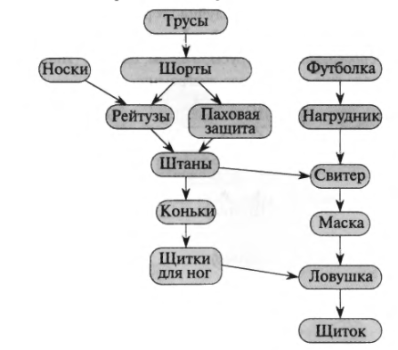
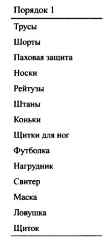

# Графы

## Оглавление
+ [Топологическая сортировка](#topological_sort)

## Теория

### <a name="topological_sort">Топологическая сортировка</a>
**Топологическая сортировка** - линейное упорядочивание вершин, которое
нужно, чтобы понять, как обходить вершины ориентированного графа.

Пример:
Например есть вот такой граф:

Линейное упорядочивание будет для этого графа вот таким:

#### Для чего нужна топологическая сортировка:
+ Чтобы понять как обходить граф, если есть такая ситуация, что мы не можем
выполнять некоторые действия до завершения других
  

#### Алгоритм
1) Создаем массив для линейного упорядочивания, заполняем нулями
2) Рассчитываем количество родителей каждой вершины
3) Находим все родительские вершины, у них в полученном массиве будет 0 родителей
4) Закидываем родителя в конец массива линейного упорядочивания, и у всех
детей этой вершины уменьшаем количество родителей на 1.
   Если появились вершины, у которых кол-во родителей стало = 0, тогда
   эта вершина стала родительской и нужно опять проделать те же операции. 
   
5) Повторяем шаг 4 пока родители не закончатся, а потом фильтруем полученный массив от нулей
