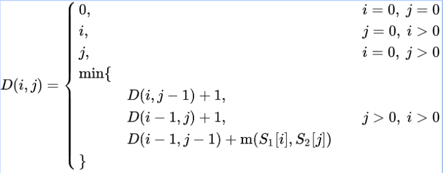
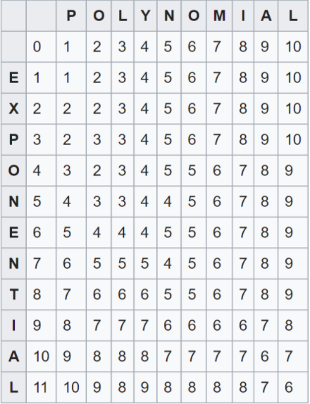
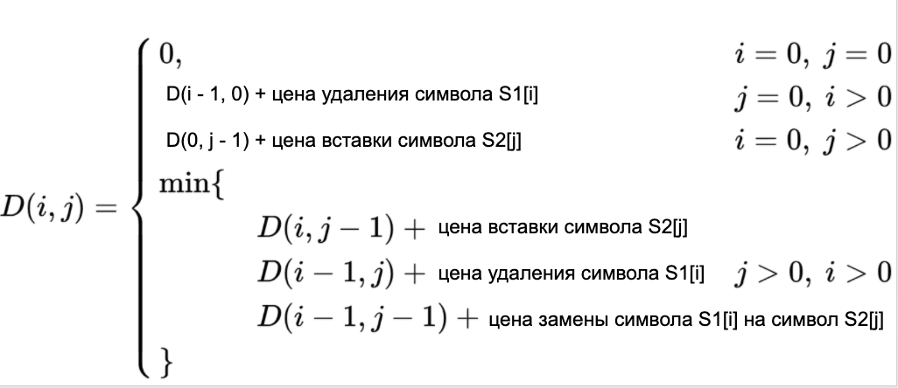

# Динамическое программирование
## Оглавление
+ [Набольшая общая подпоследовательность](#nop)
+ [Наибольшая возрастающая подпоследовательность](#nvp)
+ [Расстояние Левенштейна](#levinshtein)
+ [Пилообразная подпоследовательность](#saw-raw)
+ [Задача о рюкзаке]

## Теория

Динамическое программирование - способ решения сложных задач путем 
сведения их к более простым такого же типа.

**Плюсы:**
+ Увеличение скорости

**Минусы:**
+ Дополнительные расходы памяти

**План решения задачи на ДП:**
1. Определить целевую функцию *f*;
2. Решить задачу для маленьких ограничений;
3. Получить реккурентную формулу;
4. Определить ограничения и задать начальные значения;
5. Определить порядок вычислений;
6. Определить где будет ответ;
7. Восстановить ответ.

### <a name="nop"></a> Наибольшая общая подпоследовательность
Задача нахождения наибольшей общей подпоследовательности
(англ. longest common subsequence, LCS) — задача
поиска последовательности, которая является 
подпоследовательностью нескольких последовательностей 
(обычно двух).

Подпоследовательность можно получить из некоторой 
конечной последовательности, если удалить из 
последней некоторое множество её элементов 
(возможно пустое). Например, **BCDB** является 
подпоследовательностью последовательности **ABCDBAB**.

#### Решение за O(n<sup>2</sup>)
Обозначим через F(i) длину наибольшей возрастающей
подпоследовательности, последним элементом которой
будет элемент a<sub>i</sub>.
Рассмотрим предпоследний элемент этой последовательности
 a<sub>j</sub>, тогда a<sub>j</sub> < a<sub>i</sub> и j < i.
Необходимо найти такое подходящее j, что F(j) будет наибольшим.

```python
a = input()
b = input()

n, m = len(a), len(b)

f = []
for i in range(n+1):
    f.append([0]*(m+1))

for i in range(1,n+1):
    for j in range(1,m+1):
        if a[i-1] == b[j-1]:
            f[i][j] = f[i-1][j-1] + 1
        else:
            f[i][j] = max(f[i-1][j],f[i][j-1])
print(f[-1][-1])
```
#### Восстановление ответа
Выполним «обратный проход» по массиву
начиная с последнего элемента.

```python
i = n
j = m
ans = []
while i > 0 and j > 0:
    if a[i-1] == b[j-1]:
        ans.append(a[i-1])
        i -= 1
        j -= 1
    elif f[i][j-1] == f[i][j]:
        j -= 1
    else:
        i -= 1
print(*a[::-1])
```
### <a name="nvp"></a> Наибольшая возрастающая подпоследовательность
Задача поиска наибольшей возрастающей подпоследовательности
состоит в нахождении наиболее длинной
возрастающей подпоследовательности в
данной последовательности элементов.

#### Решение за O(n<sup>2</sup>)

##### Способ 1:

+ Отсортировать последовательность в порядке неубывания,
+ Удалим из нее повторяющиеся элементы (то есть получим строго возрастающую
последовательность из элементов изначальной последовательности,
+ Для изначальной и отсортированной последовательностей  и
найдем наибольшую общую подпоследовательность.

##### Способ 2:

+ Обозначим через F(i) длину наибольшей возрастающей
подпоследовательности, последним элементом которой
будет элемент a<sub>i</sub>.
+ Рассмотрим предпоследний элемент этой
последовательности a<sub>j</sub>, тогда
a<sub>j</sub><a<sub>i</sub> и j<i.

```python
n = int(input())
a = [int(i) for i in input().split()]
f = [0] * n
p = [-1] * n
for i in range(n):
    max_el = 0
    for j in range(i):
        if a[j] < a[i] and f[j] > f[i]:
            f[i] = f[j]
            p[i] = j
    f[i] += 1

max_el = max(f)
print(max_el)
```
#### Восстановление ответа
Массив p содержит индексы элементов, из которых он пришел, поэтому
можно пройтись от максимального элемента до начала.
```python
i = f.index(max_el)
ans = []
while i != -1:
    ans.append(a[i])
    i = p[i]
print(*ans[::-1])
```

### <a name="levinshtein"></a> Расстояние Левенштейна

Расстояние Левенштейна (редакционное расстояние,
дистанция редактирования) — метрика, измеряющая
разность между двумя последовательностями символов.
  
Она определяется как минимальное количество
односимвольных операций (а именно вставки, удаления, 
замены), необходимых для превращения одной последовательности символов в другую.

В общем случае, операциям, используемым в этом 
преобразовании, можно назначить разные цены.

Пусть S<sub>1</sub>, S<sub>2</sub> — две строки (длиной M и N соответственно)
над некоторым алфавитом, тогда редакционное расстояние
(расстояние Левенштейна) d(S<sub>1</sub>,S<sub>2</sub>) можно подсчитать по
следующей формуле (элементы строк нумеруются с первого)
: d(S1, S2) = D(M, N), где



Пример:

Здесь шаг по i символизирует удаление (D)
из первой строки, по j — вставку (I)
в первую строку, а шаг по обоим индексам
символизирует замену символа (R) или отсутствие 
изменений (M).



#### Разные цены операций

Цены операций могут зависеть от вида операции (вставка, удаление, замена) и/или от участвующих в ней символов, отражая разную вероятность мутаций в биологии, разную вероятность разных ошибок при вводе текста и т. д. В общем случае:
+ w(a, b) — цена замены символа a на символ b
+ w(ε, b) — цена вставки символа b
+ w(a, ε) — цена удаления символа a

Необходимо найти последовательность замен, минимизирующую
суммарную цену. Расстояние Левенштейна является частным
случаем этой задачи при: 
w(a, а) = 0, w(a, b) = 1 при a≠b, w(ε, b) = 1, w(a, ε) = 1.



Листинг программы:

```python
a = input()
b = input()
n, m = len(a), len(b)

dp = []
for i in range(n+1):
    dp.append([0]*(m+1))

for i in range(1,n+1):
    dp[i][0] = i

for j in range(1,m+1):
    dp[0][j] = j

for i in range(1, n+1):
    for j in range(1, m+1):
        dp[i][j] = min(dp[i-1][j-1] + (a[i-1] != b[j-1]),
         dp[i][j-1]+1, dp[i-1][j] + 1)
print(dp[-1][-1])

```

### <a name="saw-raw"></a> Пилообразная подпоследовательность
